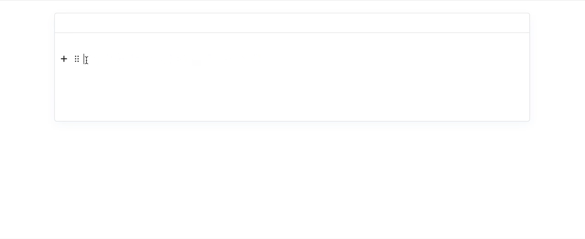

# EditorJs - CodeCup

### NPM
    npm i @calumk/editorjs-codecup

### JS
    https://cdn.jsdelivr.net/npm/@calumk/editorjs-codecup@latest

---

## About

This is an EditorJs wrapper for [CodeCup](https://github.com/calumk/codecup) - A lovely lightweight zero-dep code formatter

It was built to be an improvement on :

* https://github.com/editor-js/code - Too Basic
* https://github.com/dev-juju/codebox - Agressive styling, and exports more data than markdown can handle


## Demo




## Built with:

* [CodeCup](https://github.com/calumk/codecup)
* [Prism](https://www.npmjs.com/package/prismjs)


---

## Installation / use

```javascript
import EditorJS from '@editorjs/editorjs';
import editorjsCodecup from '@calumk/editorjs-codecup';

var editor = EditorJS({
  // ...
  tools: {
    ...
    code : editorjsCodecup
  },
});
```


## Data Format
The data imported/exported from the block is as follows:

| Name                       | Description                                                |
| -------------------------- | ---------------------------------------------------------- |
| code                       | The code that is displayed in the editor, with line breaks |
| language (optional)        | The programming language                                   |
| showlinenumbers (optional) | Will show/hide the line numbers (Default true)             |
| showCopyButton (optional)  | will show/hide the copy button (Defauly true)              |
|                            |                                                            |


Since language and linenumbers are optional, existing ```code``` blocks can safley use this plugin


<!-- ---

## Markdown Compatability

> TODO!

This plugin *will be* compatible with

    npm i editorjs-markdown-parser

It will import/export using the code fence markdown style, with the language printed imediatly after the first fence, as described in [GFM #117](https://github.github.com/gfm/#example-112)

Line-numbers cant be expressed in markdown, so will be ommited

Example :

    ```javascript
    \\ Hello World
    ``` -->
